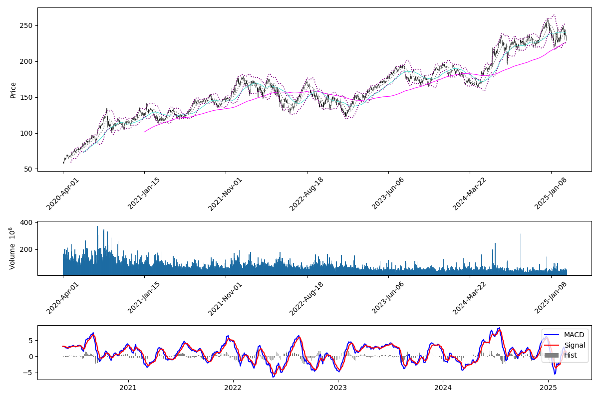
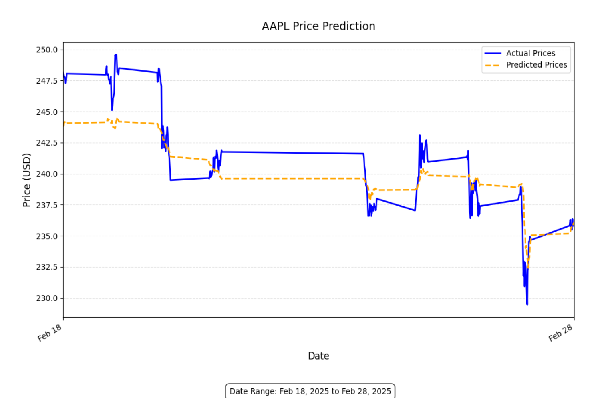
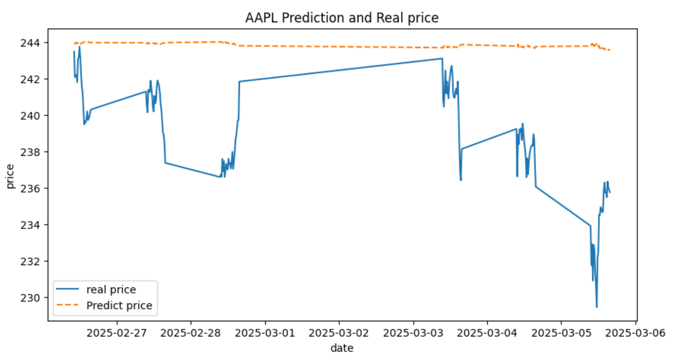

# Stock Price Prediction Using LSTM

## Midterm Presentation Video
[\[Link to Stock Price Prediction with LSTM\]](https://www.youtube.com/watch?v=A55g-Iqc7iY)

## Project Overview
The goal of this project is to develop a LSTM model to predict stock price movements based on historical stock prices, trading volume, and external financial indicators. The project aims to outperform traditional "buy-and-hold" strategies by leveraging deep learning, time-series analysis, and sentiment analysis from financial news.

## Project Goals
- Successfully predict next-day stock price movement.
- Compare different modeling approaches (LSTM, Transformer, XGBoost, GARCH, and hybrid models) mainly focus on LSTM.
- Develop an **interactive visualization dashboard** to display stock trends and sentiment analysis.
- Provide a **reproducible pipeline** that allows researchers to analyze financial data efficiently.

## Data Collection
We will collect data from the following sources:

1. **Stock Price Data**✔
   - **Source**: Yahoo Finance API
   - **Collection Method**: API calls to retrieve daily historical stock prices, adjusted close prices, and volume data.

2. **Trading Volume & Market Indicators** - in progress
   - **Source**: Alpha Vantage and Quandl
   - **Collected Data**: VIX (Volatility Index), S&P 500 index movements, bond yields.
   - **Collection Method**: Scheduled API requests with caching to avoid rate limits.

3. **Sentiment Analysis Data** (Considering switching to specific news collecting, social media is not trust worthy)
   - **Sources**: Bloomberg, Reuters (web scraping), Twitter API
   - **Collected Data**: Financial news headlines and social media sentiment related to selected stocks.
   - **Collection Method**:
     - Web scraping with BeautifulSoup or Scrapy for financial news.
     - Twitter API for real-time sentiment analysis (if API access is granted).
   - **Preprocessing Considerations**: Handling API rate limits and removing duplicate news articles.

## Data Cleaning
- **Handling Missing Values**: Forward filling, interpolation, or mean imputation.
- **Outlier Detection**: Removing extreme price fluctuations caused by stock splits or anomalies.
- **Normalization**: Standardizing numerical data to improve model performance.

## Feature Extraction
We will generate key features to enhance model learning:
- **Technical Indicators**: Moving Averages, RSI, MACD, Bollinger Bands.
- **Sentiment Features**: Extracted from financial headlines using NLP models (BERT, VADER, ChatGPT sentiment API).
- **Time-based Features**: Weekday, holiday effects, earnings release impact.

## Data Visualization
We will create multiple visualizations to explore stock trends and model insights:
- **Interactive K-line (candlestick) charts** to track stock price movements.
- **Correlation Heatmaps** to analyze feature relationships.
- **Dual-axis Line Charts** to compare sentiment analysis trends with stock price changes.
- **Model Performance Plots** comparing accuracy (MSE, R², Sharpe Ratio) across different models.
- **Interactive Dashboards (Plotly, Dash)** allowing users to dynamically select stocks and timeframes.

## Model Training
The following models will be implemented and compared:
1. **Baseline Model**: Simple Moving Average for naive prediction - ARIMA√
2. **Traditional Machine Learning Models**: XGBoost, Random Forest.
3. **Deep Learning Approaches**:
   - **LSTM (Long Short-Term Memory Networks)**: Capturing sequential dependencies in stock prices.
   - **Transformer-based Models**: Leveraging attention mechanisms for forecasting.
   - **Hybrid Models**: Combining CNN and LSTM for feature extraction and time-series prediction.

## Test Plan
- **Data Splitting**: 80% training, 20% test set.
- **Cross-validation**: Rolling window validation to ensure performance stability.
- **Evaluation Metrics**:
  - **Mean Squared Error (MSE)**
  - **R-squared (R²)**
  - **Sharpe Ratio**

## Reproducibility and GitHub Workflow
- **Repository Structure**:
  - `README.md`: Project details, setup, and usage instructions.
  - `Notebooks/`: Jupyter notebooks for data preprocessing and visualization.
  - `src/`: Python scripts for data collection, model training, and evaluation.
  - `tests/`: Unit tests for data processing and model evaluation.
- **CI/CD with GitHub Actions**:
  - Automated testing for data processing and model evaluation.
  - Linting and code formatting with pre-commit hooks.

## Timeline
| Date      | Task                                    |
|-----------|-----------------------------------------|
| **Feb 10**| Proposal Submission                     |
| **Mar 31**| Midterm Report with Preliminary Results |
| **May 1** | Final Report and Presentation           |

## Expected Outcome
- A machine learning pipeline capable of predicting stock price movements.
- Comparison of various prediction models with performance benchmarks.
- Interactive visualizations to interpret stock market behavior.
- A reproducible GitHub repository with clear documentation.

---

### Dataset Fetching
Our project implements advanced machine learning techniques to predict stock price movements, aiming for greater accuracy than traditional "buy-and-hold" strategies. We use the `yfinance` library to gather data for the **Magnificent 7** tech stocks through a well-structured pipeline that includes:
- **Configuration System**: Setting targets and parameters.
- **Validation Utility**: Ensuring system readiness.
- **Central Data Fetching Module**: Collects data across multiple timeframes.
- Data is organized in ticker-specific directories with consistent JSON formatting.
- Calculations include essential metrics such as price variations, volume trends, and volatility.

### Data Preprocessing
After raw data collection, we clean and engineer features for both ARIMA and LSTM models:
- **Technical Indicator Calculations**: 
  - RSI, MACD, Bollinger Bands, ATR, and moving averages.
- **Output Formats**:
  - A CSV file for ARIMA containing close prices and timestamps.
  - Multiple `.npz` files for LSTM using sliding windows of different lengths per timeframe.
- All outputs are saved in structured folders to ensure smooth integration with subsequent modeling steps.

### Apple Data Visualization

## Modeling Methods

### ARIMA Model

Our baseline forecasting model uses ARIMA:
- **Model Parameters**: ARIMA(p, d, q)
  - **p**: Number of past data points.
  - **d**: Degree of differencing (using d=0 for stable data or applying differences as needed).
  - **q**: Number of lagged forecast errors.
- **Observations**:
  - The model performs better on long-term (1-day interval) datasets with approximately a 70% F1 score.
  - Performance on short-term (15-min interval) data is comparatively lower.
- **Metrics**: Accuracy and F1 Score.

-**Why We Chose start with ARIMA?**

We selected ARIMA as a baseline model for our project due to its simplicity and interpretability. It serves as a solid starting point to model univariate time series data, especially when the data exhibits short-term dependencies.

Our preprocessing involves:

1. Testing for stationarity.

2. Applying differencing when necessary to achieve stationarity.

3. Fitting the ARIMA model based on optimal (p, d, q) values.

##Limitations of ARIMA:

While ARIMA is a strong classical method, it has several limitations:

1. Short-range memory: ARIMA is not designed to capture long-term dependencies or complex temporal patterns.

2. Univariate only: It cannot model multivariate relationships without extensions.

3. Assumes linearity: ARIMA works best when the underlying data generation process is linear.

Because of these constraints, we later explore more advanced models such as LSTM that better capture non-linearity and long-term trends.

### LSTM Model
Our advanced LSTM model forecasts actual price values based on high-frequency (15-minute interval) data:
- **Architecture**: A specialized LSTM network that captures sequential dependencies.
- **Performance Comparison**:
  - **Baseline Traditional Methods** (ARIMA, exponential smoothing): Achieved an R² of ~0.65 and RMSE of 1.85.
  - **LSTM Model**:
    - **RMSE**: 1.88
    - **MAE**: 1.53
    - **R²**: 0.82
    - **MAPE**: 0.63%
    - Approximately 42% of predictions fall within 0.5% of actual prices.
- **Key Observations**:
  - The LSTM model effectively smooths out extreme volatility while capturing major price trends.
  - It achieves a 15-20% higher R² compared to baseline models, especially during periods of high volatility.

## Preliminary Results
- **ARIMA**: Achieved promising results on longer-term datasets (~70% F1 score).
- **LSTM**: Demonstrated some improvements over traditional models with higher R² and lower error metrics.
- **Next Steps**:
  - Further refinement of model parameters.
  - Integration of additional data sources (e.g., sentiment analysis).
  - Extended comparative analysis across different models.

## Next Steps
- Complete and refine data visualizations.
- Fine-tune model parameters based on further experimentation.
- Expand the data processing pipeline to include additional stocks and timeframes.
- Finalize the midterm report and presentation content.

##Final Project Plan to do
--Fine Tune LSTM
--Create a 10 mins long video
---

This README serves as the working document for both the project and the midterm report/presentation. For more detailed information and the latest code, please refer to the repository structure above.
